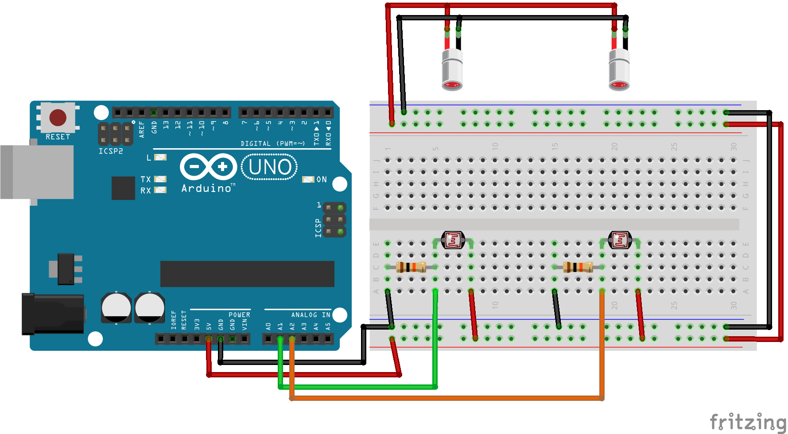

# Accelerometer

## Description

The Arduino Accelerometer is a measuring instrument that calculates the acceleration of an object in a specified distance from standstill.

## Example of output

```
Ready for start
Time started
101868 cycles in 1136 milliseconds
Such that 0.01 milliseconds per cycle
Acceleration is 2.32 m/(s*s)
```

## Schematic

